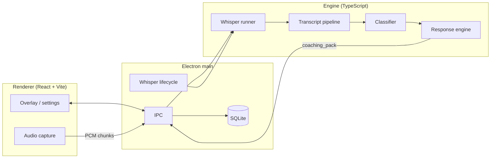

# Tele Coach

[](https://github.com/HarryRobertL/Tele-Coach/actions/workflows/ci.yml)

**Repository:** [github.com/HarryRobertL/Tele-Coach](https://github.com/HarryRobertL/Tele-Coach)

Desktop **Electron** app for real-time sales call coaching: local speech-to-text (**whisper.cpp**), objection detection, and structured coaching suggestions in a floating overlay. Audio and inference run on-device; optional analytics respect privacy settings in SQLite.

> All application source and docs live in **`tele_coach_mvp/`**. Clone the repo, then `cd tele_coach_mvp` for install and scripts.

## Live demo

There is **no browser-hosted demo**—this is a native desktop app (microphone + overlay). Install from a release build (see [docs/PACKAGING.md](tele_coach_mvp/docs/PACKAGING.md)) or run locally with `npm run dev` after setup below.

| **Distribution** | Add your **GitHub Releases** URL or internal download page here after you publish builds. |
| ---------------- | ---------------------------------------------------------------------------------------- |

## Screenshots

| App icon (branding) |
| ------------------- |
|  |

_Add UI captures (overlay compact/expanded, settings, Whisper setup) under `tele_coach_mvp/docs/screenshots/` and link them here for reviewers._

## System architecture



For module-level detail and data flow, see **[tele_coach_mvp/docs/ARCHITECTURE.md](tele_coach_mvp/docs/ARCHITECTURE.md)**.

## Tech stack

| Layer | Stack |
| ----- | ----- |
| **Desktop shell** | Electron 36, Node 18+ |
| **UI** | React 18, TypeScript, Vite 6 |
| **Main process** | TypeScript, `better-sqlite3`, IPC to renderer |
| **STT** | whisper.cpp binary + ggml model (see `engine/stt/whisper/`) |
| **Coaching engine** | TypeScript classifiers, response selector, analytics hooks |
| **Tests** | Vitest (`npm test` in `tele_coach_mvp`) |
| **CI** | GitHub Actions (typecheck + tests) |

## Environment variables

Copy **`tele_coach_mvp/.env.example`** to `.env` only if you inject variables from the shell. Runtime toggles and Whisper enterprise URLs are documented there and in **`tele_coach_mvp/config/`** (`feature_flags.json`, `whisper_delivery.json`). **Do not commit real secrets or a filled `.env`.**

## Local development

```bash
cd tele_coach_mvp
npm install
# Native module rebuild (after Node version changes)
npm run rebuild-native
# Fetch / verify Whisper assets when setting up a clean tree
npm run setup-whisper   # or follow docs/WHISPER_SETUP_NOTES.md
npm run dev
```

Other useful commands (from `tele_coach_mvp`):

```bash
npm run typecheck
npm test
npm run build
npm run start
```

Full user-facing install notes: **[tele_coach_mvp/docs/INSTALL_AND_USE.md](tele_coach_mvp/docs/INSTALL_AND_USE.md)**. Troubleshooting: **[tele_coach_mvp/docs/TROUBLESHOOTING.md](tele_coach_mvp/docs/TROUBLESHOOTING.md)**.

## Tests

```bash
cd tele_coach_mvp
npm test
```

Contract and engine tests live under `tele_coach_mvp/tests/`.

## What I built (author)

**Harry Robert Lovell** — end-to-end implementation of this MVP: Electron main/renderer integration, IPC and windowing, SQLite persistence and privacy controls, Whisper delivery and runner integration, transcript normalization and rolling-window segmentation, playbook-based objection classification and response selection, overlay UX, Vitest coverage for the coaching engine, CI workflow, and technical documentation structure. Third-party components (Electron, React, whisper.cpp, better-sqlite3, etc.) are used per `package.json`.

Business context: Tele Coach is associated with **Creditsafe**; this README focuses on the engineering artifact in this repo.

## License

© Creditsafe Limited. All rights reserved.
