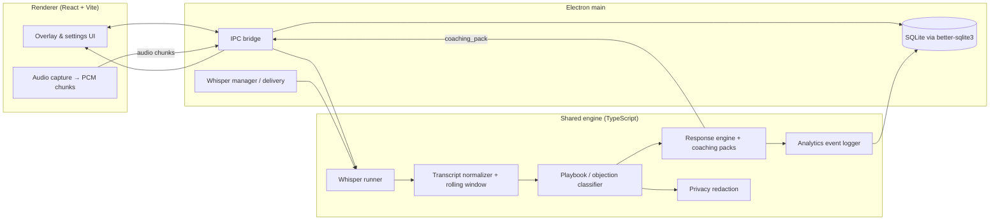

# Tele Coach — architecture

This document describes how the desktop app is structured end-to-end. Application code lives in this directory’s parent folder (`tele_coach_mvp` at the repository root).

## High-level diagram

## Data flow (coaching session)

1. **Capture**: The renderer captures microphone audio, resamples to 16 kHz mono, and sends fixed-duration frames to the main process.
2. **Transcription**: The main process runs a local **whisper.cpp** binary on sliding windows of audio (WAV temp files), emitting partial and final text events.
3. **Normalization**: **TranscriptNormalizer** deduplicates noisy partials; **TranscriptRollingWindow** and **transcript_segmenter** maintain stable text for classification.
4. **Classification**: **playbook_classifier** (and related intent / competitor signals) maps text to objection ids and metadata.
5. **Responses**: **response_engine/selector** builds a coaching pack (response, question, bridge, momentum hints).
6. **UI**: IPC pushes `stt_*` and `coaching_pack` events to the overlay; SQLite stores optional session / analytics data according to privacy settings.

## Notable directories

| Path | Role |
|------|------|
| `app/electron/` | Main process, windows, IPC, DB bootstrap, Whisper lifecycle |
| `app/renderer/` | React UI (overlay, settings, dashboard) |
| `engine/stt/` | Whisper runner, WAV helpers, transcript pipeline |
| `engine/classifier/` | Objection detection, adaptive weights, competitor / intent helpers |
| `engine/response_engine/` | Coaching pack selection |
| `engine/analytics/` | Structured event logging |
| `config/` | Feature flags and Whisper delivery policy (JSON) |

For packaging and runtime verification of Whisper assets, see `docs/PACKAGING.md` and `docs/WHISPER_VERIFICATION.md`.
